# Lingua AR - System Architecture

This document provides detailed architecture diagrams for the Lingua AR application using Mermaid diagrams that can be rendered interactively.

---

## Table of Contents
1. [System Overview](#system-overview)
2. [Component Layer Architecture](#component-layer-architecture)
3. [Scene Architecture](#scene-architecture)
4. [AR Detection Pipeline](#ar-detection-pipeline)
5. [User Interaction Flow](#user-interaction-flow)
6. [UI State Management](#ui-state-management)
7. [Vocabulary System Architecture](#vocabulary-system-architecture)
8. [Language Settings System](#language-settings-system)
9. [Translation Pipeline](#translation-pipeline)
10. [Event Flow Diagrams](#event-flow-diagrams)
11. [Database Schema](#database-schema)
12. [Design Patterns Summary](#design-patterns-summary)

---

## System Overview

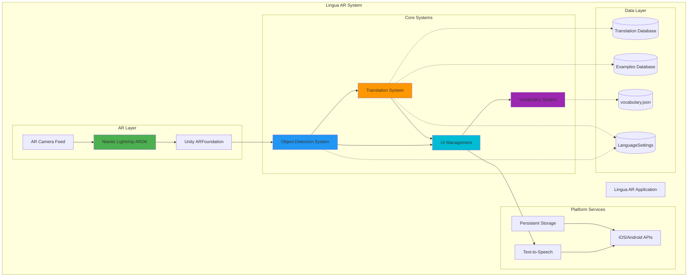
```mermaid
graph TB
    subgraph "Lingua AR System"
        App[Lingua AR Application]

        subgraph "AR Layer"
            Camera[AR Camera Feed]
            Lightship[Niantic Lightship ARDK]
            ARFoundation[Unity ARFoundation]
        end

        subgraph "Core Systems"
            Detection[Object Detection System]
            Translation[Translation System]
            Vocabulary[Vocabulary System]
            UI[UI Management]
        end

        subgraph "Platform Services"
            TTS[Text-to-Speech]
            Storage[Persistent Storage]
            Platform[iOS/Android APIs]
        end

        subgraph "Data Layer"
            TransDB[(Translation Database)]
            ExampleDB[(Examples Database)]
            VocabJSON[(vocabulary.json)]
            Settings[(LanguageSettings)]
        end
    end

    Camera --> Lightship
    Lightship --> ARFoundation
    ARFoundation --> Detection

    Detection --> Translation
    Detection --> UI
    Translation --> UI
    UI --> Vocabulary
    UI --> TTS

    Translation -.-> TransDB
    Translation -.-> ExampleDB
    Vocabulary -.-> VocabJSON
    Detection -.-> Settings
    Translation -.-> Settings

    TTS --> Platform
    Storage --> Platform

    style Lightship fill:#4CAF50
    style Detection fill:#2196F3
    style Translation fill:#FF9800
    style Vocabulary fill:#9C27B0
    style UI fill:#00BCD4
```

---

## Component Layer Architecture

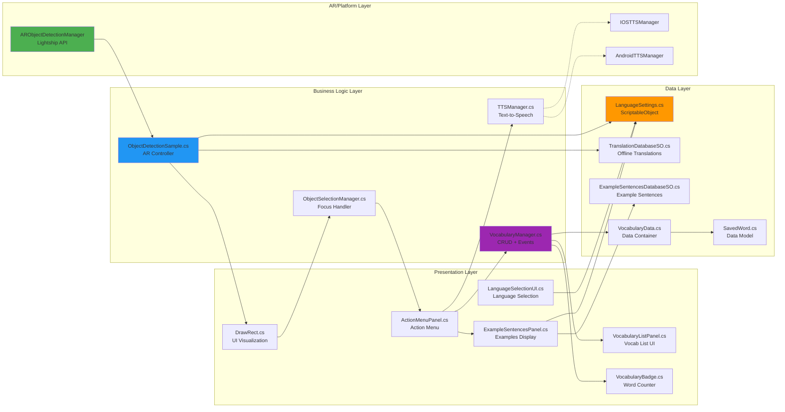
```mermaid
graph LR
    subgraph "Presentation Layer"
        DrawRect[DrawRect.cs<br/>UI Visualization]
        ActionMenu[ActionMenuPanel.cs<br/>Action Menu]
        VocabList[VocabularyListPanel.cs<br/>Vocab List UI]
        ExamplesPanel[ExampleSentencesPanel.cs<br/>Examples Display]
        Badge[VocabularyBadge.cs<br/>Word Counter]
        LangUI[LanguageSelectionUI.cs<br/>Language Selection]
    end

    subgraph "Business Logic Layer"
        ObjDetection[ObjectDetectionSample.cs<br/>AR Controller]
        ObjSelection[ObjectSelectionManager.cs<br/>Focus Handler]
        VocabMgr[VocabularyManager.cs<br/>CRUD + Events]
        TTSMgr[TTSManager.cs<br/>Text-to-Speech]
    end

    subgraph "Data Layer"
        LangSettings[LanguageSettings.cs<br/>ScriptableObject]
        TransDB[TranslationDatabaseSO.cs<br/>Offline Translations]
        ExampleDB[ExampleSentencesDatabaseSO.cs<br/>Example Sentences]
        VocabData[VocabularyData.cs<br/>Data Container]
        SavedWord[SavedWord.cs<br/>Data Model]
    end

    subgraph "AR/Platform Layer"
        ARMgr[ARObjectDetectionManager<br/>Lightship API]
        iOSTTS[IOSTTSManager]
        AndroidTTS[AndroidTTSManager]
    end

    ARMgr --> ObjDetection
    ObjDetection --> DrawRect
    ObjDetection --> TransDB
    ObjDetection --> LangSettings

    DrawRect --> ObjSelection
    ObjSelection --> ActionMenu
    ActionMenu --> VocabMgr
    ActionMenu --> ExamplesPanel
    ActionMenu --> TTSMgr

    VocabMgr --> VocabList
    VocabMgr --> Badge
    VocabMgr --> VocabData
    VocabData --> SavedWord

    ExamplesPanel --> ExampleDB
    ExamplesPanel --> LangSettings

    LangUI --> LangSettings

    TTSMgr -.-> iOSTTS
    TTSMgr -.-> AndroidTTS

    style ObjDetection fill:#2196F3
    style VocabMgr fill:#9C27B0
    style LangSettings fill:#FF9800
    style ARMgr fill:#4CAF50
```

---

## Scene Architecture

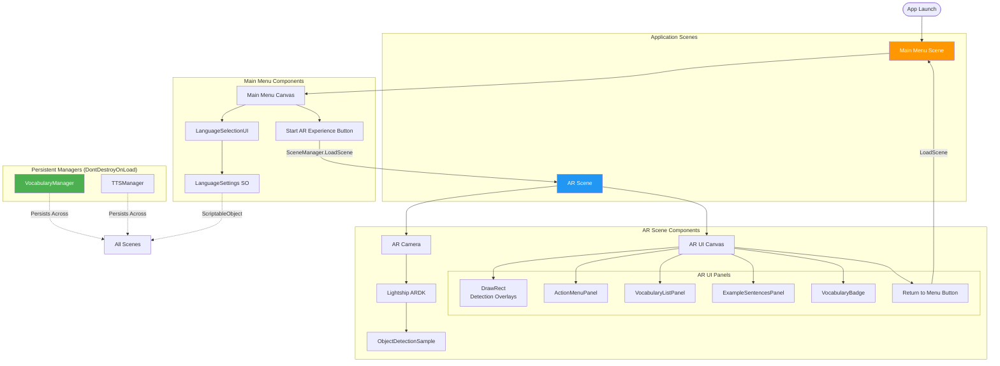
```mermaid
graph TB
    subgraph "Application Scenes"
        MainMenu[Main Menu Scene]
        ARScene[AR Scene]
    end

    subgraph "Main Menu Components"
        MenuUI[Main Menu Canvas]
        LangUI[LanguageSelectionUI]
        LangSettings[LanguageSettings SO]
        ARButton[Start AR Experience Button]
    end

    subgraph "AR Scene Components"
        ARCamera[AR Camera]
        Lightship[Lightship ARDK]
        ObjDetection[ObjectDetectionSample]
        UICanvas[AR UI Canvas]

        subgraph "AR UI Panels"
            DrawRect[DrawRect<br/>Detection Overlays]
            ActionMenu[ActionMenuPanel]
            VocabList[VocabularyListPanel]
            ExamplesPanel[ExampleSentencesPanel]
            Badge[VocabularyBadge]
            ReturnButton[Return to Menu Button]
        end
    end

    subgraph "Persistent Managers (DontDestroyOnLoad)"
        VocabMgr[VocabularyManager]
        TTSMgr[TTSManager]
    end

    Start([App Launch]) --> MainMenu

    MainMenu --> MenuUI
    MenuUI --> LangUI
    LangUI --> LangSettings
    MenuUI --> ARButton

    ARButton -->|SceneManager.LoadScene| ARScene

    ARScene --> ARCamera
    ARScene --> UICanvas
    ARCamera --> Lightship
    Lightship --> ObjDetection
    UICanvas --> DrawRect
    UICanvas --> ActionMenu
    UICanvas --> VocabList
    UICanvas --> ExamplesPanel
    UICanvas --> Badge
    UICanvas --> ReturnButton

    ReturnButton -->|LoadScene| MainMenu

    VocabMgr -.->|Persists Across| AllScenes[All Scenes]
    TTSMgr -.->|Persists Across| AllScenes
    LangSettings -.->|ScriptableObject| AllScenes

    style MainMenu fill:#FF9800,color:#fff
    style ARScene fill:#2196F3,color:#fff
    style VocabMgr fill:#4CAF50,color:#fff
```

**Scene Flow:**
- **Main Menu**: Entry point for language selection and AR experience launch
- **AR Scene**: Primary AR learning experience with object detection
- **Persistent Managers**: VocabularyManager and TTSManager survive scene transitions
- **ScriptableObjects**: LanguageSettings shared across all scenes

---

## AR Detection Pipeline

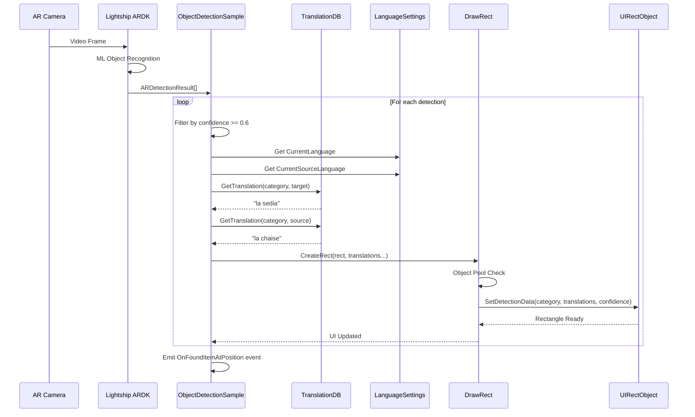
```mermaid
sequenceDiagram
    participant Camera as AR Camera
    participant Lightship as Lightship ARDK
    participant ODS as ObjectDetectionSample
    participant TransDB as TranslationDB
    participant LangSet as LanguageSettings
    participant DrawRect as DrawRect
    participant UIRect as UIRectObject

    Camera->>Lightship: Video Frame
    Lightship->>Lightship: ML Object Recognition
    Lightship->>ODS: ARDetectionResult[]

    loop For each detection
        ODS->>ODS: Filter by confidence >= 0.6
        ODS->>LangSet: Get CurrentLanguage
        ODS->>LangSet: Get CurrentSourceLanguage
        ODS->>TransDB: GetTranslation(category, target)
        TransDB-->>ODS: "la sedia"
        ODS->>TransDB: GetTranslation(category, source)
        TransDB-->>ODS: "la chaise"

        ODS->>DrawRect: CreateRect(rect, translations...)
        DrawRect->>DrawRect: Object Pool Check
        DrawRect->>UIRect: SetDetectionData(category, translations, confidence)
        UIRect-->>DrawRect: Rectangle Ready
        DrawRect-->>ODS: UI Updated
    end

    ODS->>ODS: Emit OnFoundItemAtPosition event
```

---

## User Interaction Flow

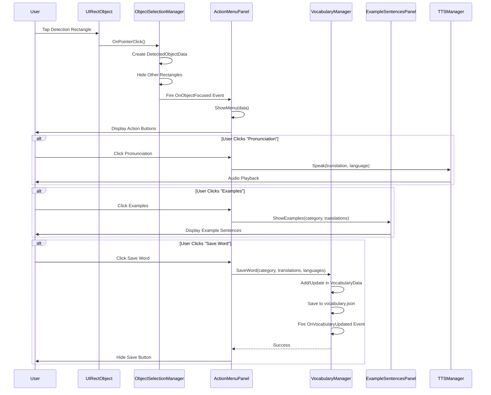
```mermaid
sequenceDiagram
    participant User
    participant UIRect as UIRectObject
    participant ObjSel as ObjectSelectionManager
    participant ActionMenu as ActionMenuPanel
    participant VocabMgr as VocabularyManager
    participant ExPanel as ExampleSentencesPanel
    participant TTS as TTSManager

    User->>UIRect: Tap Detection Rectangle
    UIRect->>ObjSel: OnPointerClick()

    ObjSel->>ObjSel: Create DetectedObjectData
    ObjSel->>ObjSel: Hide Other Rectangles
    ObjSel->>ActionMenu: Fire OnObjectFocused Event

    ActionMenu->>ActionMenu: ShowMenu(data)
    ActionMenu->>User: Display Action Buttons

    alt User Clicks "Pronunciation"
        User->>ActionMenu: Click Pronunciation
        ActionMenu->>TTS: Speak(translation, language)
        TTS->>User: Audio Playback
    end

    alt User Clicks "Examples"
        User->>ActionMenu: Click Examples
        ActionMenu->>ExPanel: ShowExamples(category, translations)
        ExPanel->>User: Display Example Sentences
    end

    alt User Clicks "Save Word"
        User->>ActionMenu: Click Save Word
        ActionMenu->>VocabMgr: SaveWord(category, translations, languages)
        VocabMgr->>VocabMgr: Add/Update in VocabularyData
        VocabMgr->>VocabMgr: Save to vocabulary.json
        VocabMgr->>VocabMgr: Fire OnVocabularyUpdated Event
        VocabMgr-->>ActionMenu: Success
        ActionMenu->>User: Hide Save Button
    end
```

---

## UI State Management

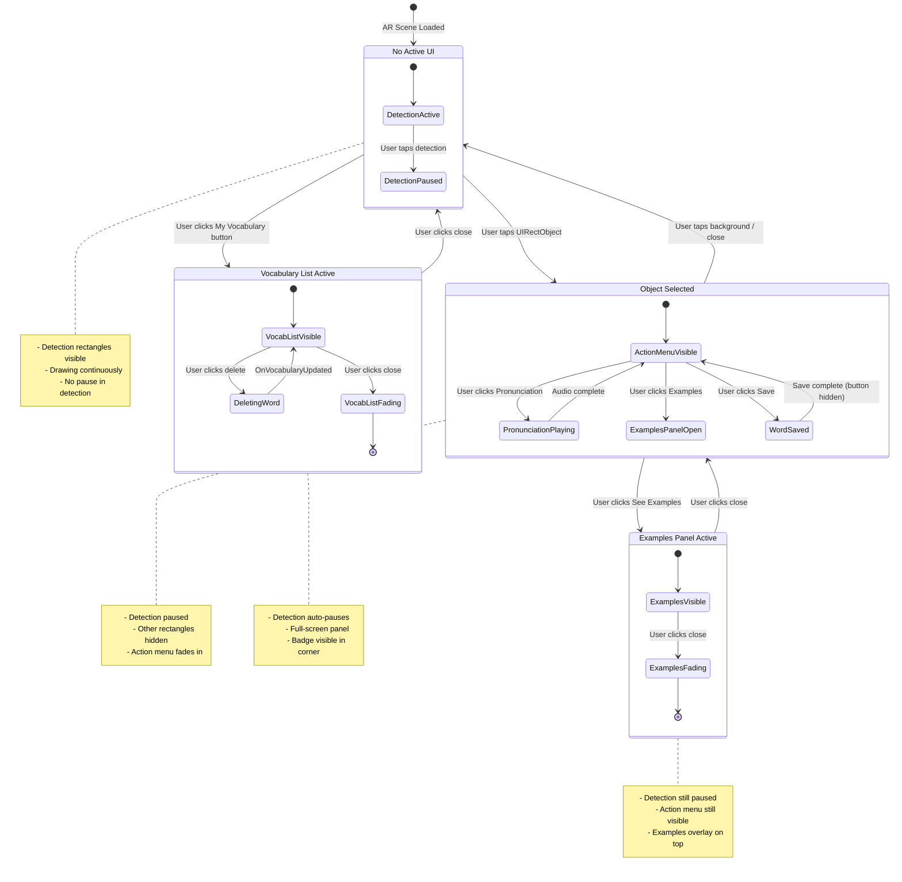
```mermaid
stateDiagram-v2
    [*] --> Idle: AR Scene Loaded

    state "No Active UI" as Idle {
        [*] --> DetectionActive
        DetectionActive --> DetectionPaused: User taps detection
    }

    state "Object Selected" as Selected {
        [*] --> ActionMenuVisible
        ActionMenuVisible --> PronunciationPlaying: User clicks Pronunciation
        ActionMenuVisible --> ExamplesPanelOpen: User clicks Examples
        ActionMenuVisible --> WordSaved: User clicks Save

        PronunciationPlaying --> ActionMenuVisible: Audio complete
        WordSaved --> ActionMenuVisible: Save complete (button hidden)
    }

    state "Examples Panel Active" as Examples {
        [*] --> ExamplesVisible
        ExamplesVisible --> ExamplesFading: User clicks close
        ExamplesFading --> [*]
    }

    state "Vocabulary List Active" as VocabList {
        [*] --> VocabListVisible
        VocabListVisible --> DeletingWord: User clicks delete
        DeletingWord --> VocabListVisible: OnVocabularyUpdated
        VocabListVisible --> VocabListFading: User clicks close
        VocabListFading --> [*]
    }

    Idle --> Selected: User taps UIRectObject
    Selected --> Idle: User taps background / close

    Idle --> VocabList: User clicks My Vocabulary button
    VocabList --> Idle: User clicks close

    Selected --> Examples: User clicks See Examples
    Examples --> Selected: User clicks close

    note right of Idle
        - Detection rectangles visible
        - Drawing continuously
        - No pause in detection
    end note

    note right of Selected
        - Detection paused
        - Other rectangles hidden
        - Action menu fades in
    end note

    note right of Examples
        - Detection still paused
        - Action menu still visible
        - Examples overlay on top
    end note

    note right of VocabList
        - Detection auto-pauses
        - Full-screen panel
        - Badge visible in corner
    end note
```

**UI Panel States:**

| Panel | Initial State | Trigger | Visibility Control |
|-------|---------------|---------|-------------------|
| **DrawRect** | Active | Always running when no panel open | CanvasGroup alpha (fade) |
| **ActionMenuPanel** | Hidden | Object selection | CanvasGroup alpha + SetActive |
| **ExampleSentencesPanel** | Hidden | "See Examples" button | CanvasGroup alpha + SetActive |
| **VocabularyListPanel** | Hidden | "My Vocabulary" button | CanvasGroup alpha + SetActive |
| **VocabularyBadge** | Always visible | VocabularyManager events | Text updates dynamically |

**Detection Pause Logic:**
- **Paused when**: ActionMenuPanel is open OR VocabularyListPanel is open
- **Resumed when**: User closes panels and returns to idle state
- **Implementation**: `ObjectDetectionSample._isPaused` flag

---

## Vocabulary System Architecture

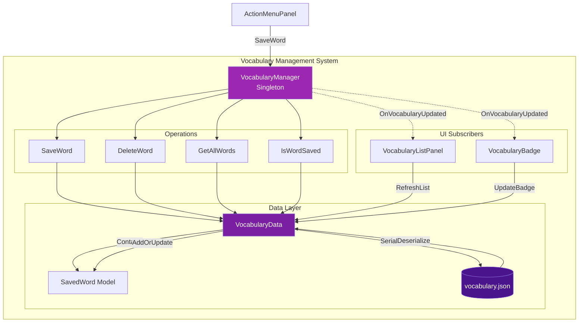
```mermaid
graph TB
    subgraph "Vocabulary Management System"
        VocabMgr[VocabularyManager<br/>Singleton]

        subgraph "Data Layer"
            VocabData[VocabularyData]
            SavedWord[SavedWord Model]
            JSON[(vocabulary.json)]
        end

        subgraph "UI Subscribers"
            VocabList[VocabularyListPanel]
            Badge[VocabularyBadge]
        end

        subgraph "Operations"
            Save[SaveWord]
            Delete[DeleteWord]
            Get[GetAllWords]
            Check[IsWordSaved]
        end
    end

    ActionMenu[ActionMenuPanel] -->|SaveWord| VocabMgr

    VocabMgr --> Save
    VocabMgr --> Delete
    VocabMgr --> Get
    VocabMgr --> Check

    Save --> VocabData
    Delete --> VocabData
    Get --> VocabData
    Check --> VocabData

    VocabData -->|Contains| SavedWord
    VocabData -->|AddOrUpdate| SavedWord
    VocabData -->|Serialize| JSON
    JSON -->|Deserialize| VocabData

    VocabMgr -.->|OnVocabularyUpdated| VocabList
    VocabMgr -.->|OnVocabularyUpdated| Badge

    VocabList -->|RefreshList| VocabData
    Badge -->|UpdateBadge| VocabData

    style VocabMgr fill:#9C27B0,color:#fff
    style VocabData fill:#7B1FA2,color:#fff
    style JSON fill:#4A148C,color:#fff
```

---

## Language Settings System

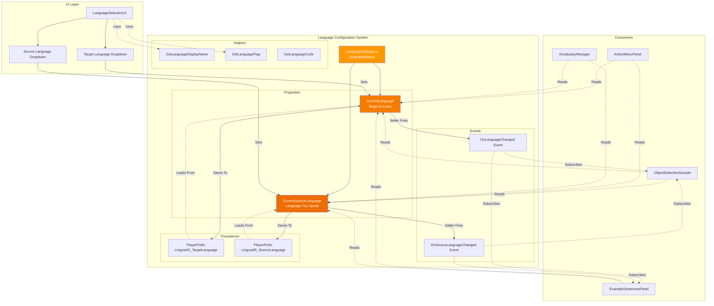
```mermaid
graph TB
    subgraph "Language Configuration System"
        LangSettings[LanguageSettings.cs<br/>ScriptableObject]

        subgraph "Properties"
            TargetLang[CurrentLanguage<br/>Target to Learn]
            SourceLang[CurrentSourceLanguage<br/>Language You Speak]
        end

        subgraph "Events"
            OnTargetChange[OnLanguageChanged Event]
            OnSourceChange[OnSourceLanguageChanged Event]
        end

        subgraph "Persistence"
            TargetPrefs[PlayerPrefs:<br/>LinguaAR_TargetLanguage]
            SourcePrefs[PlayerPrefs:<br/>LinguaAR_SourceLanguage]
        end

        subgraph "Helpers"
            DisplayName[GetLanguageDisplayName]
            Flag[GetLanguageFlag]
            Code[GetLanguageCode]
        end
    end

    subgraph "UI Layer"
        LangUI[LanguageSelectionUI]
        TargetDropdown[Target Language Dropdown]
        SourceDropdown[Source Language Dropdown]
    end

    subgraph "Consumers"
        ObjDetection[ObjectDetectionSample]
        ExamplesPanel[ExampleSentencesPanel]
        ActionMenu[ActionMenuPanel]
        VocabMgr[VocabularyManager]
    end

    LangSettings --> TargetLang
    LangSettings --> SourceLang

    TargetLang -->|Setter Fires| OnTargetChange
    SourceLang -->|Setter Fires| OnSourceChange

    TargetLang -->|Saves To| TargetPrefs
    SourceLang -->|Saves To| SourcePrefs

    TargetPrefs -.->|Loads From| TargetLang
    SourcePrefs -.->|Loads From| SourceLang

    LangUI --> TargetDropdown
    LangUI --> SourceDropdown
    TargetDropdown -->|Sets| TargetLang
    SourceDropdown -->|Sets| SourceLang

    LangUI -.->|Uses| DisplayName
    LangUI -.->|Uses| Flag

    OnTargetChange -.->|Subscribes| ObjDetection
    OnTargetChange -.->|Subscribes| ExamplesPanel
    OnSourceChange -.->|Subscribes| ObjDetection
    OnSourceChange -.->|Subscribes| ExamplesPanel

    ObjDetection -.->|Reads| TargetLang
    ObjDetection -.->|Reads| SourceLang
    ExamplesPanel -.->|Reads| TargetLang
    ExamplesPanel -.->|Reads| SourceLang
    ActionMenu -.->|Reads| TargetLang
    ActionMenu -.->|Reads| SourceLang
    VocabMgr -.->|Reads| TargetLang
    VocabMgr -.->|Reads| SourceLang

    style LangSettings fill:#FF9800,color:#fff
    style TargetLang fill:#F57C00,color:#fff
    style SourceLang fill:#EF6C00,color:#fff
```

---

## Translation Pipeline

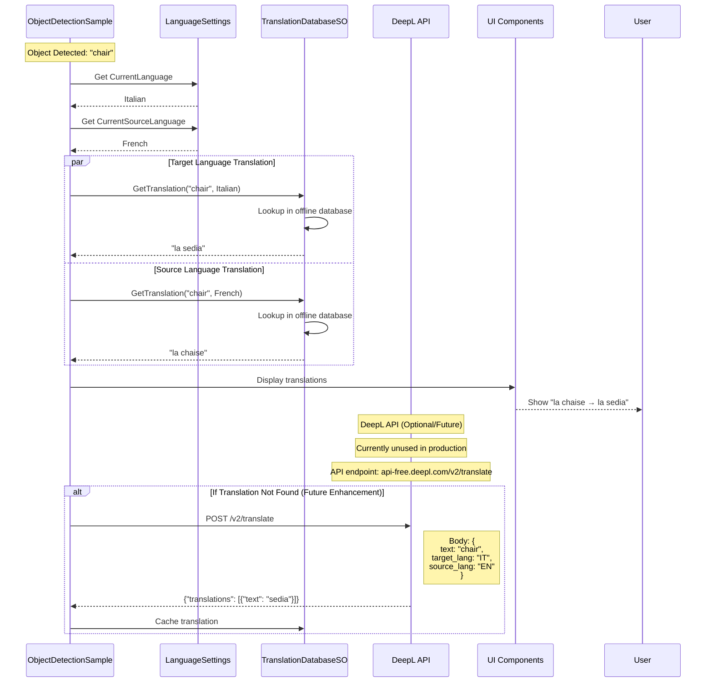
```mermaid
sequenceDiagram
    participant ODS as ObjectDetectionSample
    participant LangSet as LanguageSettings
    participant TransDB as TranslationDatabaseSO
    participant DeepL as DeepL API
    participant UI as UI Components

    Note over ODS: Object Detected: "chair"

    ODS->>LangSet: Get CurrentLanguage
    LangSet-->>ODS: Italian

    ODS->>LangSet: Get CurrentSourceLanguage
    LangSet-->>ODS: French

    par Target Language Translation
        ODS->>TransDB: GetTranslation("chair", Italian)
        TransDB->>TransDB: Lookup in offline database
        TransDB-->>ODS: "la sedia"
    and Source Language Translation
        ODS->>TransDB: GetTranslation("chair", French)
        TransDB->>TransDB: Lookup in offline database
        TransDB-->>ODS: "la chaise"
    end

    ODS->>UI: Display translations
    UI-->>User: Show "la chaise → la sedia"

    Note over DeepL: DeepL API (Optional/Future)
    Note over DeepL: Currently unused in production
    Note over DeepL: API endpoint: api-free.deepl.com/v2/translate

    alt If Translation Not Found (Future Enhancement)
        ODS->>DeepL: POST /v2/translate
        Note right of DeepL: Body: {<br/>  text: "chair",<br/>  target_lang: "IT",<br/>  source_lang: "EN"<br/>}
        DeepL-->>ODS: {"translations": [{"text": "sedia"}]}
        ODS->>TransDB: Cache translation
    end
```

**Translation Strategy:**

| Component | Type | Content | Purpose |
|-----------|------|---------|---------|
| **TranslationDatabaseSO** | ScriptableObject | 206 pre-translated words × 4 languages | Offline, instant translation |
| **ExampleSentencesDatabaseSO** | ScriptableObject | Example sentences in all languages | Context-rich learning |
| **DeepL API** | External REST API | Real-time translation service | Fallback (not currently used) |

**Translation Flow:**

1. **Object Detection**: Lightship identifies object category (e.g., "chair")
2. **Language Retrieval**: Get current source and target languages from LanguageSettings
3. **Database Lookup**: Query TranslationDatabaseSO for both translations
4. **UI Display**: Show bilingual label on detection rectangle
5. **Caching**: All translations pre-loaded in ScriptableObjects (no runtime API calls)

**Data Structure in TranslationDatabaseSO:**

```csharp
[Serializable]
public class TranslationEntry {
    public string category;           // "chair"
    public string englishTranslation; // "chair"
    public string frenchTranslation;  // "la chaise"
    public string germanTranslation;  // "der Stuhl"
    public string italianTranslation; // "la sedia"
}
```

**Benefits of Offline-First Approach:**
- ✅ No API costs during runtime
- ✅ Works without internet connection
- ✅ Zero latency translations
- ✅ Predictable performance
- ✅ No rate limiting concerns

---

## Event Flow Diagrams

### Vocabulary Update Event Flow

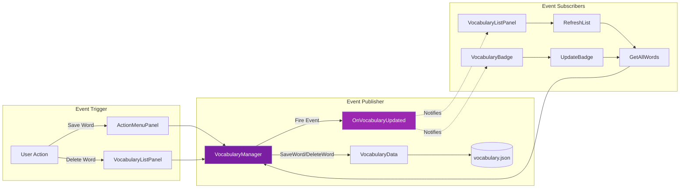
```mermaid
graph LR
    subgraph "Event Trigger"
        User[User Action]
        User -->|Save Word| ActionMenu[ActionMenuPanel]
        User -->|Delete Word| VocabList[VocabularyListPanel]
    end

    subgraph "Event Publisher"
        ActionMenu --> VocabMgr[VocabularyManager]
        VocabList --> VocabMgr
        VocabMgr -->|SaveWord/DeleteWord| VocabData[VocabularyData]
        VocabData --> JSON[(vocabulary.json)]
        VocabMgr -->|Fire Event| OnVocabUpdated[OnVocabularyUpdated]
    end

    subgraph "Event Subscribers"
        OnVocabUpdated -.->|Notifies| VocabListSub[VocabularyListPanel]
        OnVocabUpdated -.->|Notifies| BadgeSub[VocabularyBadge]

        VocabListSub --> RefreshList[RefreshList]
        BadgeSub --> UpdateBadge[UpdateBadge]

        RefreshList --> GetWords[GetAllWords]
        UpdateBadge --> GetWords

        GetWords --> VocabMgr
    end

    style OnVocabUpdated fill:#9C27B0,color:#fff
    style VocabMgr fill:#7B1FA2,color:#fff
```

### Language Change Event Flow

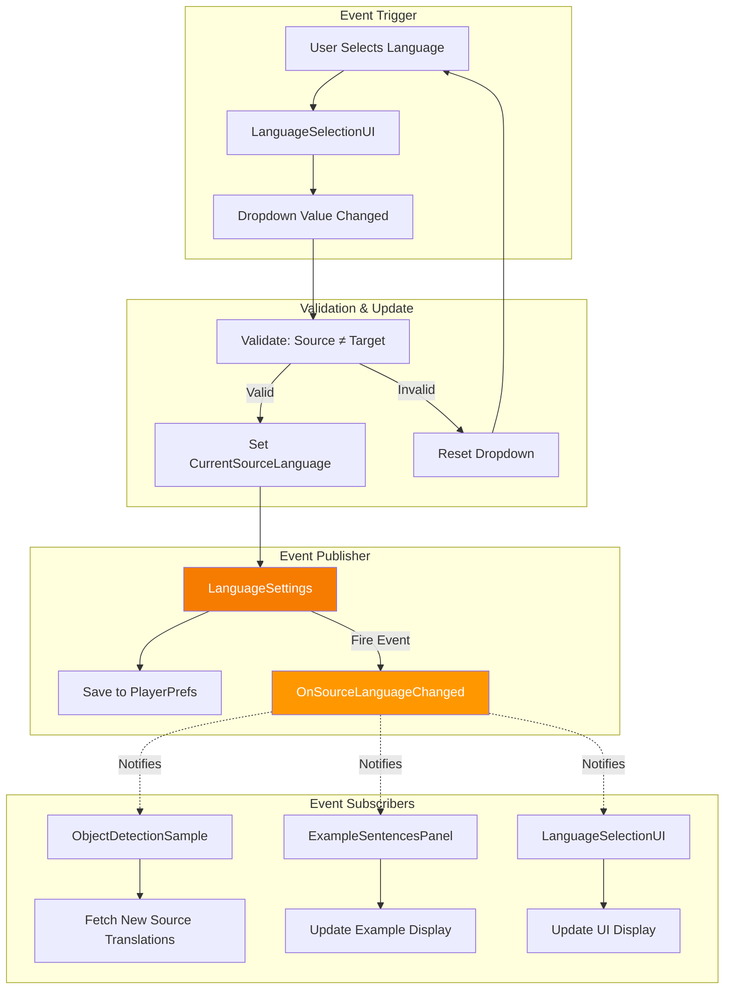
```mermaid
graph TB
    subgraph "Event Trigger"
        User[User Selects Language]
        User --> LangUI[LanguageSelectionUI]
        LangUI --> Dropdown[Dropdown Value Changed]
    end

    subgraph "Validation & Update"
        Dropdown --> Validate[Validate: Source ≠ Target]
        Validate -->|Valid| SetLang[Set CurrentSourceLanguage]
        Validate -->|Invalid| Reset[Reset Dropdown]
        Reset --> User
    end

    subgraph "Event Publisher"
        SetLang --> LangSettings[LanguageSettings]
        LangSettings --> SavePrefs[Save to PlayerPrefs]
        LangSettings -->|Fire Event| OnSourceChanged[OnSourceLanguageChanged]
    end

    subgraph "Event Subscribers"
        OnSourceChanged -.->|Notifies| ObjDetection[ObjectDetectionSample]
        OnSourceChanged -.->|Notifies| ExamplesPanel[ExampleSentencesPanel]
        OnSourceChanged -.->|Notifies| LangUISub[LanguageSelectionUI]

        ObjDetection --> FetchTrans[Fetch New Source Translations]
        ExamplesPanel --> UpdateExamples[Update Example Display]
        LangUISub --> UpdateUI[Update UI Display]
    end

    style OnSourceChanged fill:#FF9800,color:#fff
    style LangSettings fill:#F57C00,color:#fff
```

---

## Database Schema

### TranslationDatabaseSO Structure

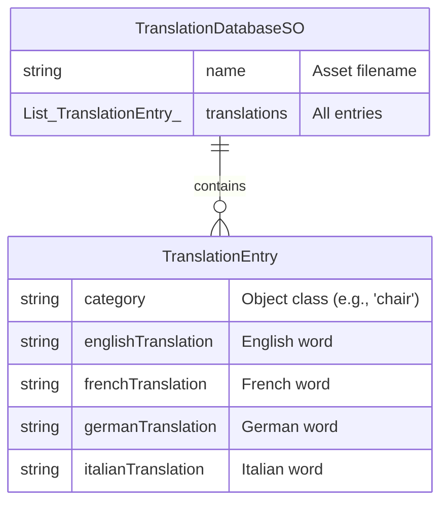
```mermaid
erDiagram
    TranslationDatabaseSO ||--o{ TranslationEntry : contains

    TranslationDatabaseSO {
        string name "Asset filename"
        List_TranslationEntry_ translations "All entries"
    }

    TranslationEntry {
        string category "Object class (e.g., 'chair')"
        string englishTranslation "English word"
        string frenchTranslation "French word"
        string germanTranslation "German word"
        string italianTranslation "Italian word"
    }
```

**Example Data:**

| category | englishTranslation | frenchTranslation | germanTranslation | italianTranslation |
|----------|-------------------|-------------------|-------------------|-------------------|
| chair | chair | la chaise | der Stuhl | la sedia |
| table | table | la table | der Tisch | il tavolo |
| book | book | le livre | das Buch | il libro |
| lamp | lamp | la lampe | die Lampe | la lampada |
| ... | ... | ... | ... | ... |

**Total Coverage:** 206 object categories × 4 languages = 824 translations

---

### ExampleSentencesDatabaseSO Structure

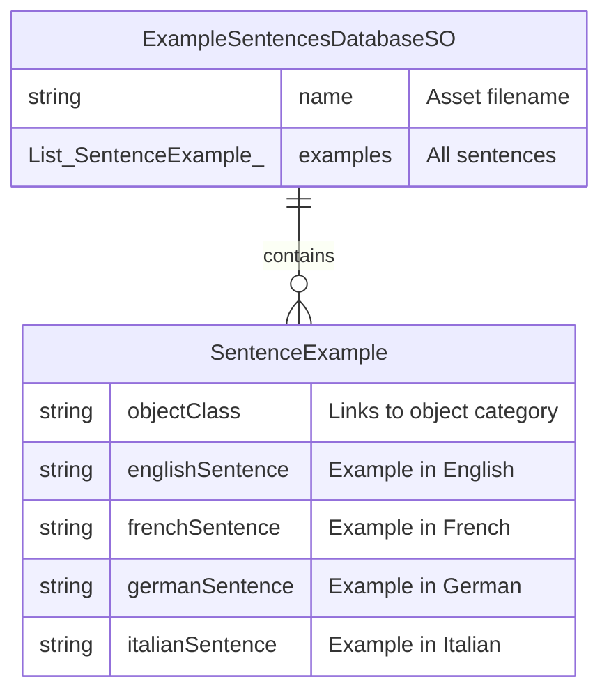
```mermaid
erDiagram
    ExampleSentencesDatabaseSO ||--o{ SentenceExample : contains

    ExampleSentencesDatabaseSO {
        string name "Asset filename"
        List_SentenceExample_ examples "All sentences"
    }

    SentenceExample {
        string objectClass "Links to object category"
        string englishSentence "Example in English"
        string frenchSentence "Example in French"
        string germanSentence "Example in German"
        string italianSentence "Example in Italian"
    }
```

**Example Data:**

| objectClass | englishSentence | frenchSentence | germanSentence | italianSentence |
|-------------|----------------|----------------|----------------|----------------|
| chair | The chair is comfortable. | La chaise est confortable. | Der Stuhl ist bequem. | La sedia è comoda. |
| chair | Please sit on the chair. | Assieds-toi sur la chaise. | Bitte setz dich auf den Stuhl. | Per favore siediti sulla sedia. |
| table | The book is on the table. | Le livre est sur la table. | Das Buch liegt auf dem Tisch. | Il libro è sul tavolo. |

**Key Features:**
- Multiple example sentences per object class
- All sentences translated into 4 languages
- Context-rich learning material
- Dynamically queried based on detected object

---

### VocabularyData JSON Schema

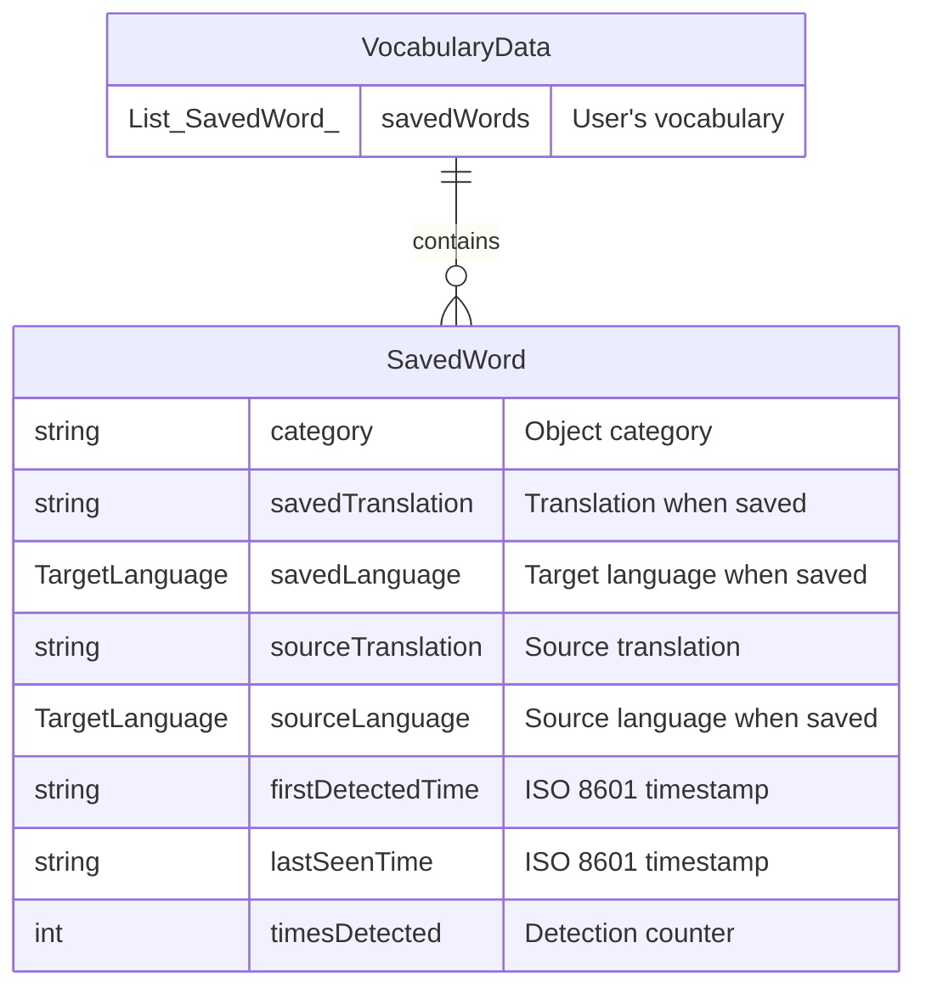
```mermaid
erDiagram
    VocabularyData ||--o{ SavedWord : contains

    VocabularyData {
        List_SavedWord_ savedWords "User's vocabulary"
    }

    SavedWord {
        string category "Object category"
        string savedTranslation "Translation when saved"
        TargetLanguage savedLanguage "Target language when saved"
        string sourceTranslation "Source translation"
        TargetLanguage sourceLanguage "Source language when saved"
        string firstDetectedTime "ISO 8601 timestamp"
        string lastSeenTime "ISO 8601 timestamp"
        int timesDetected "Detection counter"
    }
```

**JSON File Location:**
```
Application.persistentDataPath + "/vocabulary.json"

Platform Paths:
- iOS: /var/mobile/Containers/Data/Application/{GUID}/Documents/vocabulary.json
- Android: /storage/emulated/0/Android/data/{package}/files/vocabulary.json
- Windows: C:\Users\{user}\AppData\LocalLow\{company}\{product}\vocabulary.json
```

**Example JSON:**

```json
{
  "savedWords": [
    {
      "category": "chair",
      "savedTranslation": "la sedia",
      "savedLanguage": 3,
      "sourceTranslation": "la chaise",
      "sourceLanguage": 1,
      "firstDetectedTime": "2025-12-14T10:30:00Z",
      "lastSeenTime": "2025-12-14T15:45:00Z",
      "timesDetected": 5
    },
    {
      "category": "table",
      "savedTranslation": "il tavolo",
      "savedLanguage": 3,
      "sourceTranslation": "la table",
      "sourceLanguage": 1,
      "firstDetectedTime": "2025-12-14T11:00:00Z",
      "lastSeenTime": "2025-12-14T11:00:00Z",
      "timesDetected": 1
    }
  ]
}
```

**TargetLanguage Enum Mapping:**
```csharp
0 = English
1 = French
2 = German
3 = Italian
```

---

### LanguageSettings PlayerPrefs Schema

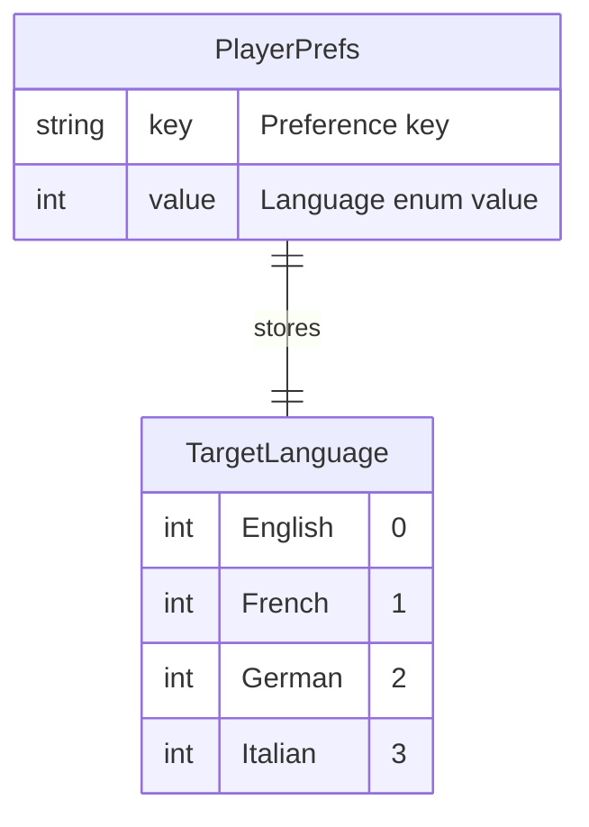
```mermaid
erDiagram
    PlayerPrefs {
        string key "Preference key"
        int value "Language enum value"
    }

    PlayerPrefs ||--|| TargetLanguage : stores

    TargetLanguage {
        int English "0"
        int French "1"
        int German "2"
        int Italian "3"
    }
```

**Stored Keys:**

| Key | Type | Default | Description |
|-----|------|---------|-------------|
| `LinguaAR_TargetLanguage` | int | 3 (Italian) | Language user is learning |
| `LinguaAR_SourceLanguage` | int | 0 (English) | Language user speaks |

**Persistence Behavior:**
- Saved immediately when language is changed
- Loaded on LanguageSettings.Initialize()
- Survives app restarts
- Platform-specific storage (Registry on Windows, plist on iOS, XML on Android)

---

## Design Patterns Summary

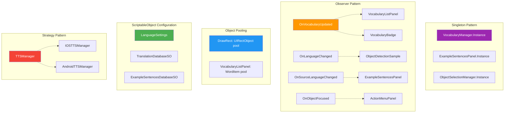
```mermaid
graph TB
    subgraph "Singleton Pattern"
        VM[VocabularyManager.Instance]
        ESP[ExampleSentencesPanel.Instance]
        OSM[ObjectSelectionManager.Instance]
    end

    subgraph "Observer Pattern"
        Event1[OnVocabularyUpdated]
        Event2[OnLanguageChanged]
        Event3[OnSourceLanguageChanged]
        Event4[OnObjectFocused]

        Event1 -.-> Sub1[VocabularyListPanel]
        Event1 -.-> Sub2[VocabularyBadge]
        Event2 -.-> Sub3[ObjectDetectionSample]
        Event3 -.-> Sub4[ExampleSentencesPanel]
        Event4 -.-> Sub5[ActionMenuPanel]
    end

    subgraph "Object Pooling"
        Pool1[DrawRect: UIRectObject pool]
        Pool2[VocabularyListPanel: WordItem pool]
    end

    subgraph "ScriptableObject Configuration"
        SO1[LanguageSettings]
        SO2[TranslationDatabaseSO]
        SO3[ExampleSentencesDatabaseSO]
    end

    subgraph "Strategy Pattern"
        Strat[TTSManager]
        Strat -.-> iOS[IOSTTSManager]
        Strat -.-> Android[AndroidTTSManager]
    end

    style VM fill:#9C27B0,color:#fff
    style Event1 fill:#FF9800,color:#fff
    style Pool1 fill:#2196F3,color:#fff
    style SO1 fill:#4CAF50,color:#fff
    style Strat fill:#F44336,color:#fff
```

---

## Data Persistence Architecture

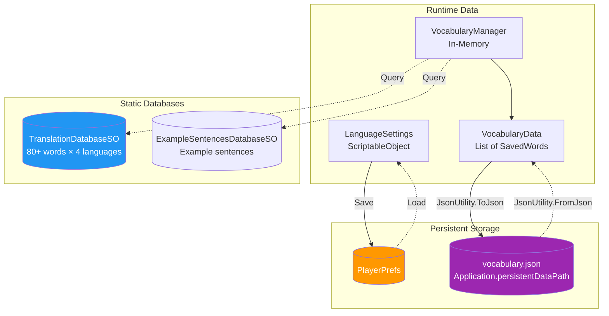
```mermaid
graph TB
    subgraph "Runtime Data"
        LangSettings[LanguageSettings<br/>ScriptableObject]
        VocabMgr[VocabularyManager<br/>In-Memory]
        VocabData[VocabularyData<br/>List of SavedWords]
    end

    subgraph "Persistent Storage"
        PlayerPrefs[(PlayerPrefs)]
        JSON[(vocabulary.json<br/>Application.persistentDataPath)]
    end

    subgraph "Static Databases"
        TransDB[(TranslationDatabaseSO<br/>80+ words × 4 languages)]
        ExampleDB[(ExampleSentencesDatabaseSO<br/>Example sentences)]
    end

    LangSettings -->|Save| PlayerPrefs
    PlayerPrefs -.->|Load| LangSettings

    VocabMgr --> VocabData
    VocabData -->|JsonUtility.ToJson| JSON
    JSON -.->|JsonUtility.FromJson| VocabData

    VocabMgr -.->|Query| TransDB
    VocabMgr -.->|Query| ExampleDB

    style JSON fill:#9C27B0,color:#fff
    style PlayerPrefs fill:#FF9800,color:#fff
    style TransDB fill:#2196F3,color:#fff
```

---

## Summary

This architecture demonstrates:

1. **Clear Separation of Concerns**: AR detection, UI, business logic, and data layers are distinct
2. **Event-Driven Communication**: Components communicate via events, reducing coupling
3. **Efficient Resource Management**: Object pooling for frequently created/destroyed UI elements
4. **Data-Driven Design**: ScriptableObjects for configuration and static data
5. **Platform Abstraction**: Strategy pattern for platform-specific implementations (iOS/Android)
6. **Persistent State**: PlayerPrefs and JSON for user data persistence across sessions
7. **Bilingual Support**: Complete source/target language architecture throughout the system
8. **Offline-First Translation**: Pre-loaded databases eliminate API dependency and latency
9. **State-Based UI Management**: Clear state transitions with CanvasGroup fade animations
10. **Multi-Scene Architecture**: Persistent managers and ScriptableObjects survive scene transitions

### Architecture Coverage

This document includes **13 comprehensive diagrams**:

- **System & Component Architecture** (2 diagrams): High-level overview and layer structure
- **Scene Architecture** (1 diagram): Two-scene navigation (Main Menu → AR Scene) and persistent managers
- **Flow Diagrams** (4 diagrams): AR detection pipeline, user interactions, vocabulary updates, language changes
- **UI State Management** (1 diagram): Panel states and detection pause logic
- **Translation Pipeline** (1 diagram): Offline database lookup with bilingual support
- **Database Schemas** (4 diagrams): Translation DB, examples DB, vocabulary JSON, and PlayerPrefs
- **Design Patterns** (1 diagram): Singleton, Observer, Pooling, Strategy, ScriptableObject patterns
- **Data Persistence** (1 diagram): Runtime data, persistent storage, and static databases

### Key Architectural Strengths

✅ **Decoupled Systems**: Events enable independent component evolution
✅ **Zero Runtime Translation Costs**: All translations pre-loaded in ScriptableObjects
✅ **Cross-Platform Compatibility**: Single codebase targets iOS and Android
✅ **User Data Persistence**: Vocabulary and settings survive app lifecycle
✅ **Performance Optimized**: Object pooling prevents GC pressure during AR sessions
✅ **Maintainable**: Clear patterns and singleton access simplify debugging

---

**For user documentation, see [README.md](README.md)**
